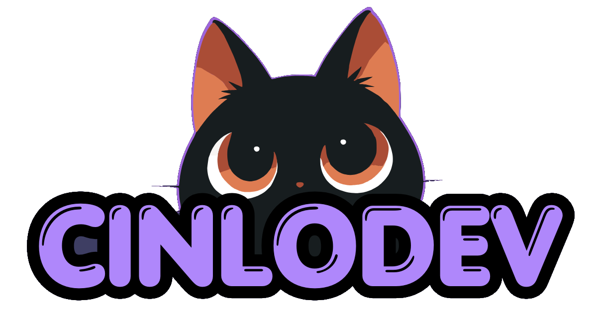

---

# CinloDev Link Hub

Bienvenidos al universo digital de **CinloDev**. 

Más que un simple "Linktree", este proyecto es un **SaaS-like Bento Dashboard** diseñado para centralizar mi portfolio, herramientas, productos SaaS y redes bajo una estética extremadamente cuidada, premium y minimalista.

---

## ✨ Filosofía de Diseño

La interfaz fue construida buscando transmitir una sensación de *"Cozy Developer Setup"*:

- **Glassmorphism Elegante**: Tarjetas de cristal translúcidas flotando sobre un setup nocturno con sutiles halos de luz violeta.
- **Dark Mode Nativo**: Pensado y diseñado para entornos oscuros, usando tonos morados profundos y luces neón suaves.
- **Minimalismo Premium**: Mucho aire visual, tipografías modernas (Sora) y una jerarquía clara donde el contenido y los proyectos son los verdaderos protagonistas.
- **El factor Neko**: El sutil acompañamiento de Neko a través de micro-interacciones ocultas (hover effects) para darle vida y personalidad a la interfaz sin saturarla.

## 🚀 Tech Stack

Este hub está construido con herramientas modernas, enfocadas en performance y experiencia de desarrollo:

- **Framework**: Next.js (App Router)
- **Librería UI**: React 19
- **Estilos**: Tailwind CSS v4
- **Animaciones**: Framer Motion
- **Iconografía**: Lucide React & SVGs personalizados
- **Linter / Formatter**: Biome
- **Package Manager**: pnpm

## 🍱 Arquitectura Bento Grid

El layout fue diseñado de cero para abandonar la aburrida lista vertical de links y escalar perfectamente en cualquier dispositivo:
- **Desktop**: Un elegante y espacioso Bento Grid 2x2 para los proyectos destacados, ofreciendo una experiencia similar a entrar a un dashboard de un producto SaaS real.
- **Mobile**: Apilamiento vertical con tarjetas amplias, optimizado para una lectura rápida y navegación ágil con el pulgar.

## 🎨 Easter Eggs & Micro-Interacciones

- **Físicas y animaciones**: Cada tarjeta cuenta con físicas elásticas (escala dinámica) al pasar el cursor o hacer "tap" en móviles.
- **Neko escondido**: En lugar de ensuciar el diseño con mascotas flotantes, Neko vive escondido detrás de los componentes de su propia herramienta (*NekoTools*), asomándose con un salto elástico únicamente cuando interactúas con ella.
- **Iluminación Dinámica**: Uso estratégico de sombras, `backdrop-blur` y desenfoque radial (`blur-3xl`) para crear ilusiones de profundidad real.

---

> *"Hecho con café, código y magia."* — **CinloDev**
